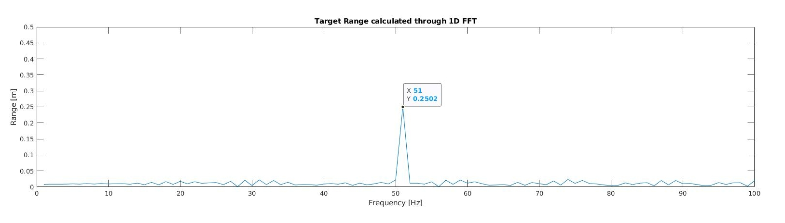
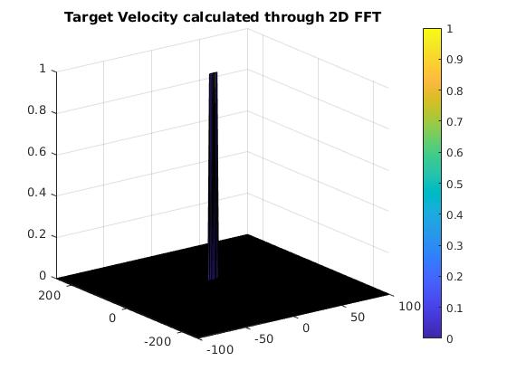

## Radar Target Generation and Detection

1. FMCW Waveform design

    Specs
    ```matlab
    %Specs
    c = 3e8; %m/s
    max_range = 200; % m/s
    range_resolution = 1; %m
    max_velocity = 100; %m/s
    ```

    Results
    ```matlab
    Bsweep = c / (2*range_resolution);
    trip_time = (2 * max_range)/c;
    Tchirp = 5.5 * trip_time;
    slope = Bsweep/Tchirp;
    ```


2. Simulate Target

    ```matlab
    for i=1:length(t)          
        r_t(i) = target_range + (target_velocity*t(i));
        td(i) = 2*r_t(i)/c; %Time delay
        
        Tx(i) = cos(2*pi*(fc*t(i) + (slope/2)*t(i)*t(i)));
        time_difference = t(i) - td(i);
        Rx(i)  = cos(2*pi*(fc*(time_difference) + (slope/2)*(time_difference^2)));
        
        Mix(i) = Tx(i) .* Rx(i);
    end
    ```

3. Range FFT

Range estimated through 1D FFT


4. 2D CFAR



- Choosing Training and guard cells

    Since we are in a non dense and non cluttered environment, we can select a large number of training cells:
    Here we choose 
    ```matlab
    Tr = 5; Td = 5;
    Gr = 2; Gd =2;
    offset = 5; %dB
    ```

- CFAR Implementation Steps
    1. Iterate over the valid cells which can be considered for CFAR.
        a. Iterate over the grid that includes training and guard cells.
            - If a cell is outside guard region, consider the cell value. Else ignore.
        b. Sum the cell amplitudes by adding the linear value of the cell signal
    2. Average the total amplitude to get an average measure of the noise
    3. Convert the noise back to dB
    4. Add the offset to the noise threshold
    5. For the Cell under test, check whether signal value is above threshold.
        a. If > Threshold, set to 1
        b. < Threshold, set to 0
    ```matlab
    for range_ix = (Gr+Tr+1) : (Nr/2 - (Gr+Tr))
        for doppler_ix = (Gd+Td+1) : (Nd - (Gd+Td))
            noise_level = zeros(1,1);
            for row = range_ix - (Gr+Tr): range_ix + (Gr + Tr)
                for column = doppler_ix -(Gd + Td): doppler_ix + (Gd + Td)
                    if(abs(range_ix - row) > Gr || abs(doppler_ix - column) > Gd)
                        noise_level = noise_level + db2pow(RDM(row,column));
                    end
                end
            end
            noise_level = noise_level/n_training_cells;
            noise_level = pow2db(noise_level);
            noise_level = noise_level + offset;
    
            if(RDM(range_ix,doppler_ix) > noise_level)
                thresholded_RDM(range_ix,doppler_ix) = 1;
            else
                thresholded_RDM(range_ix,doppler_ix) = 0;
            end
        end
    end
    ```

- Steps taken to suppress non thresholded cells

    We find the indexes of those cells whose values are neither 1 nor 0, creating a mask
    We set these indexes to 0

    ```matlab
    non_zero_indexes = thresholded_RDM ~= 0
    non_one_indexes = thresholded_RDM ~= 1
    non_thresholded_mask = non_one_indexes & non_zero_indexes
    thresholded_RDM(non_thresholded_mask) = 0;
    ```
